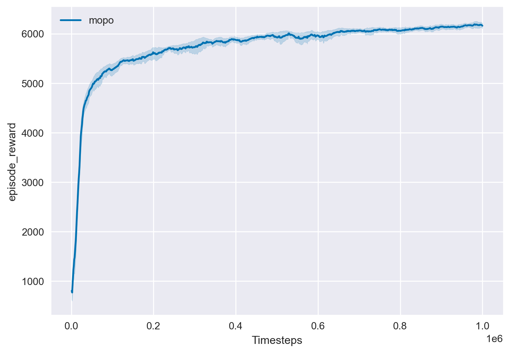

# Overview

This is a re-implementation of the offline model-based RL algorithm MOPO all by pytorch **(including dynamics and mopo algo)** as described in the following paper: [MOPO: Model-based Offline Policy Optimization](https://arxiv.org/pdf/2005.13239.pdf)

The performance of model-based RL algorithm greatly depends on the implementation of the ensemble dynamics model and we find that the performance of pytorch ensemble models implemented by third parties will be reduced compared with the official implementation. To this end, we reuse the official tensorflow version ensemble model. Don't worry, the implementation of the ensemble model is separate from our core code, which will not affect the simplicity of pytorch.

# Dependencies

- MuJoCo 2.0
- Gym 0.22.0
- D4RL
- PyTorch 1.8+

# Usage

## Train

```
# for hopper-medium-replay-v0 task
python train.py --task "hopper-medium-replay-v0" --rollout-length 5 --reward-penalty-coef 1.0
# for walker2d-medium-replay-v0 task
python train.py --task "walker2d-medium-replay-v0" --rollout-length 1 --reward-penalty-coef 1.0
# for halfcheetah-medium-replay-v0 task
python train.py --task "halfcheetah-medium-replay-v0" --rollout-length 5 --reward-penalty-coef 1.0
```

For different mujoco tasks, the only differences of hyperparameters are "rollout-length" and "reward-penalty-coef". Please see the original paper for other tasks' hyperparameters.

## Plot

```
python plotter.py --root-dir "log" --task "hopper-medium-replay-v0"
```

# Reproduced results
All experiments were run for 2 random seeds each and learning curves are smoothed by averaging over a window of 10 epochs.

### hopper-medium-replay-v0


### walker2d-medium-replay-v0


### halfcheetah-medium-replay-v0



# Reference

- Official tensorflow implementation: [https://github.com/tianheyu927/mopo](https://github.com/tianheyu927/mopo)

'Droid Sans Mono', 'monospace', monospace